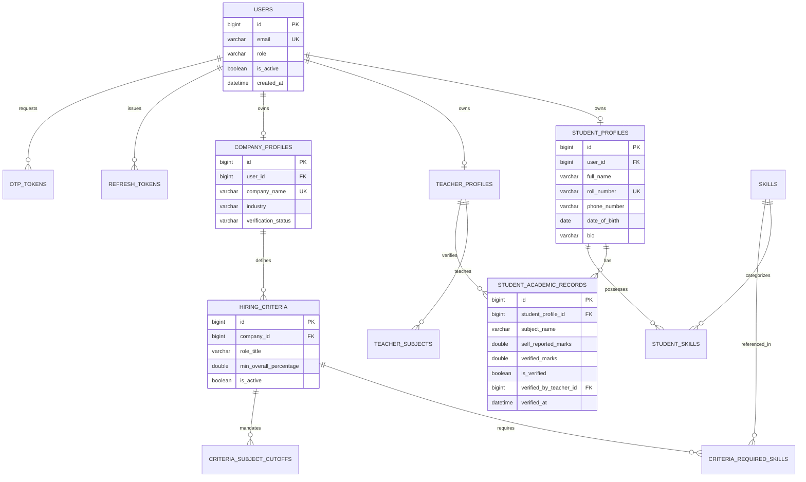
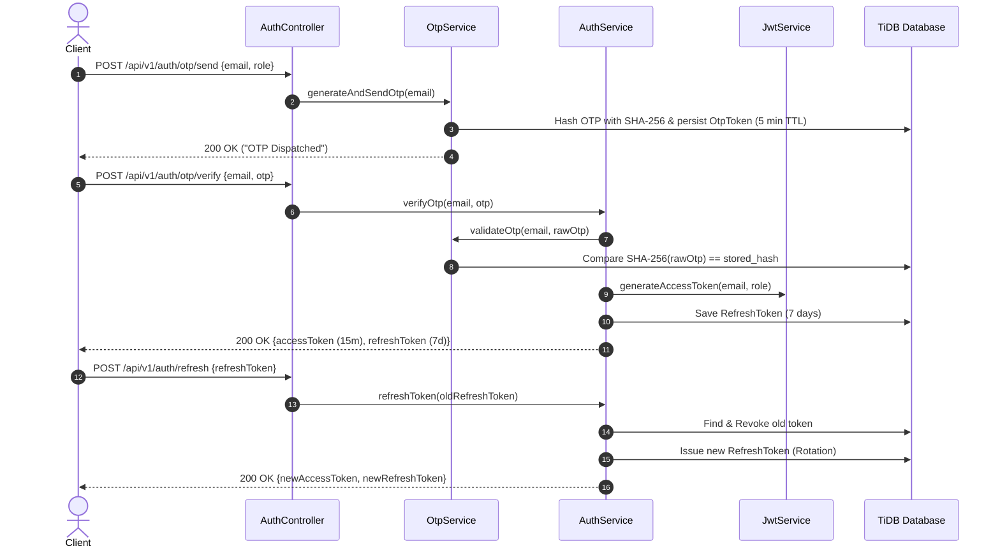
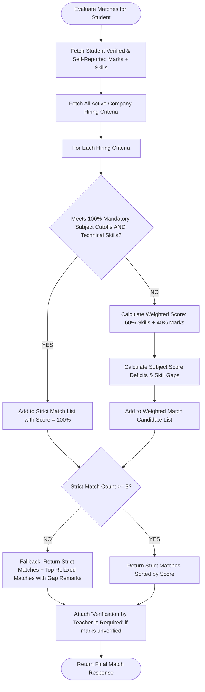

# Student-Corporate Matcher: Technical Project Architecture & Debugging Guide

---

## 1. System Overview & Technology Stack

| Layer | Technology | Version | Purpose |
| :--- | :--- | :--- | :--- |
| **Language** | Java | **21 (LTS)** | Core language with records, pattern matching & virtual threads |
| **Framework** | Spring Boot | **3.4.2** | Dependency injection, MVC, and autoconfiguration |
| **Security** | Spring Security + JJWT | **6.4.2 / 0.12.6** | Stateless JWT authentication, RBAC, and Refresh Token Rotation |
| **Persistence** | Spring Data JPA / Hibernate | **6.6.5** | Object-relational mapping, lazy loading, JPQL |
| **Database** | MySQL / TiDB Cloud | **Wire 8.0** | Scalable distributed cloud SQL database with SSL/TLS |
| **Validation** | Jakarta Bean Validation | **3.1.0** | Declarative schema validation (`@Valid`, `@Min`, `@Max`, `@Email`) |
| **Documentation** | Springdoc OpenAPI / Swagger | **2.8.4** | Interactive OpenAPI 3.0 UI and API specifications |
| **Testing** | JUnit 5 + Mockito + AssertJ | **5.11.4** | Unit, integration, security, and mock MVC slice testing |
| **Containerization** | Docker (Multi-stage) | **Temurin 21 JRE** | Minimal container image with non-root security user |

---

## 2. Architecture & Class Hierarchy

```
com.matcher.platform
├── config/                  # SecurityConfig, MethodSecurityConfig, OpenApiConfig
├── controller/              # REST API controllers (Auth, Student, Teacher, Company, Admin)
├── dto/
│   ├── common/              # ApiResponse<T>, ErrorDetail, PageResponse<T>
│   ├── request/             # Request payloads (30+ pure Java POJOs with builder)
│   └── response/            # Response payloads
├── entity/                  # JPA Entities (User, StudentProfile, Skill, Criteria, etc.)
│   └── enums/               # RoleType, ProficiencyLevel, CompanyVerificationStatus, MatchType
├── exception/               # GlobalExceptionHandler, Custom Exceptions
├── repository/              # Spring Data JPA interfaces with custom JPQL queries
├── security/                # JwtService, JwtAuthenticationFilter, OtpService, RateLimitingFilter, SecurityGuard, XssSanitizer
└── service/                 # Business logic, AuthService, StudentService, MatchingEngineService, etc.
```

---

## 3. Entity-Relationship (ER) Diagram



---

## 4. Security Subsystem & Filter Chain

### 4.1 Filter Chain Execution Order
```
Incoming HTTP Request
      │
      ▼
[RateLimitingFilter] ──(>60 req/min)──► HTTP 429 Too Many Requests
      │ (Allowed)
      ▼
[JwtAuthenticationFilter] ──(Bearer Token Present)──► Validate Signature & Expiry
      │                                                ├── Valid ──► Set SecurityContext (Principal & Roles)
      │                                                └── Invalid ──► Clear Context
      ▼
[SecurityFilterChain] ──(RBAC Check)──►
      ├── Public (/api/v1/auth/**, /api/v1/companies/public/**) ──► Allow
      ├── Admin (/api/v1/admin/**) ──► Requires ROLE_ADMIN
      └── Authenticated (/api/v1/students/**, etc.) ──► Requires Role
      │
      ▼
[SecurityGuard] (IDOR Tenant Check) ──► Reject (403) if modifying another user's ID
      │
      ▼
[Controller & Service (with XssSanitizer)]
```

### 4.2 Authentication & Token Rotation Sequence



---

## 5. Intelligent Dual-Mode Matching Algorithm

Implemented in `MatchingEngineService.java`:



---

## 6. Comprehensive Debugging & Troubleshooting Guide

### 6.1 Database Connection Issues (TiDB Cloud)
* **Symptom:** `CommunicationsException: Communications link failure` or `SSLHandshakeException`.
* **Root Causes & Solutions:**
  1. **SSL Mode Requirement:** TiDB Cloud mandates TLS. Ensure `sslMode=REQUIRED&useSSL=true` is in `spring.datasource.url`.
  2. **Port Configuration:** TiDB Cloud operates on port `4000`, not default MySQL `3306`.
  3. **IP Allowlist:** Check your TiDB Cloud cluster console under **Security > IP Access List** and ensure your local IP or `0.0.0.0/0` is allowed.
  4. **Environment Variables:** Verify `.env` or system environment variables:
     ```properties
     DB_HOST=gateway01.ap-southeast-1.prod.aws.tidbcloud.com
     DB_PORT=4000
     DB_USERNAME=q3hd9LT3m4krfbn.root
     DB_PASSWORD=<your_db_password>
     ```

---

### 6.2 Authentication & JWT Troubleshooting
* **Symptom:** `401 Unauthorized` with `{"message":"Authentication required: Invalid or missing token"}`.
  * **Resolution:** Ensure the HTTP header has format `Authorization: Bearer eyJhbGci...`. Do not omit the word `Bearer` and space.
* **Symptom:** Token expired after 15 minutes.
  * **Resolution:** Send `POST /api/v1/auth/refresh` with the `refreshToken` to acquire a new 15-minute access token.
* **Symptom:** `403 Forbidden` on role-protected endpoints.
  * **Resolution:** Check user role in JWT payload using [jwt.io](https://jwt.io). A user with `ROLE_STUDENT` cannot call `/api/v1/teachers/**` or `/api/v1/admin/**`.

---

### 6.3 Rate Limiting `429 Too Many Requests`
* **Symptom:** `429` status code received on `/api/v1/auth/otp/send`.
  * **Resolution:** The system enforces a 60 requests/minute window per IP. Wait 60 seconds before retrying or adjust `MAX_REQUESTS_PER_MINUTE` in `RateLimitingFilter.java` for development load tests.

---

### 6.4 Missing Data / IDOR Access Errors
* **Symptom:** `403 Forbidden` when updating a company's criteria or student's marks.
  * **Resolution:** `SecurityGuard` prevents tenant crosstalk. Ensure the authenticated JWT belongs to the specific owner of the resource being updated.

---

### 6.5 Running Tests Locally
To execute the entire suite of 42 tests:
```powershell
./mvnw clean test
```
To run a specific test:
```powershell
./mvnw test -Dtest=MatchingEngineServiceTest
```
