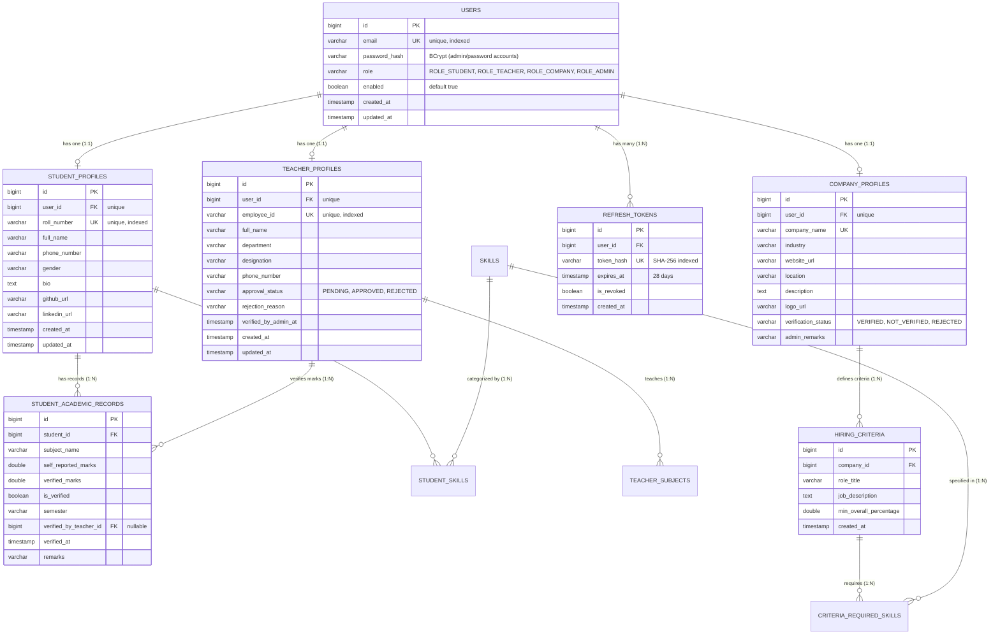

# Student-Corporate Matcher Platform - System Architecture & Internal Engineering Guide

> **Enterprise Grade**: Spring Boot 3.4.2 + Java 21 LTS + TiDB Cloud (Serverless MySQL Dialect)  
> **Security Protocol**: Zero-Trust, Master Admin 2-Step (Password + OTP), 28-Day Refresh Rotation, IDOR Protection, Faculty Approval Queue  
> **Server Efficiency Profile**: Optimized for Low-RAM (~250MB JVM on 500MB Host) with Serial GC & Tiered C1 JIT

---

## 1. System Architecture & ER Diagram

---

## 2. Core Security & Lifecycle Workflows

### 2.1. Master Admin 2-Step Login & Emergency Recovery
1. Admin initiates login at `POST /api/v1/auth/admin/otp/send` with `email` + `password`.
2. Server validates password against BCrypt `password_hash`.
3. Server generates 6-digit OTP and dispatches it to `amansingh.mothari85@gmail.com` and mirror security copy to `hans31144@gmail.com`.
4. Admin submits OTP at `POST /api/v1/auth/otp/verify` to receive JWT + 28-day Refresh Token.
5. All administrative routes (`/api/v1/admin/**`) are guarded via SpEL:
   `@PreAuthorize("hasRole('ADMIN') and @securityGuard.isMasterAdmin(principal)")`

### 2.2. Teacher Self-Registration & Approval Lifecycle
1. Faculty self-register at `POST /api/v1/teachers/register`.
2. Account is provisioned with `approvalStatus = PENDING`.
3. If teacher attempts to log in before Admin verification, `AuthService` throws:
   `ForbiddenException("No further action, verification is in waiting")`.
4. Admin inspects pending queue via `GET /api/v1/admin/teachers/pending`.
5. Admin approves via `POST /api/v1/admin/teachers/{id}/approve`.
6. Teacher can now log in and perform official mark verifications.

### 2.3. Anti-Flood Mail Quota Limiter
- **Daily Quota**: 400 emails/day, resetting at 00:00 UTC.
- **Per-Email Anti-Flood**: 60-second cooldown between resend requests.

---

## 3. Low-RAM Deployment Configuration (500MB Host Target)

### JVM Tuning
- **Garbage Collector**: `-XX:+UseSerialGC` (Eliminates parallel GC worker thread stacks, saving ~60MB).
- **Heap Limits**: `-Xms96m -Xmx256m` (Caps JVM heap at 256MB).
- **Metaspace Limit**: `-XX:MaxMetaspaceSize=128m`.
- **JIT Compilation**: `-XX:+TieredCompilation -XX:TieredStopAtLevel=1` (C1 JIT only; fast startup in <3s, saving ~60MB code cache).
- **Database Connection Pool**: HikariCP `maximum-pool-size=3` and `minimum-idle=1`.

### Micro Ping Keep-Alive
- Endpoint: `GET /api/v1/ping` or `GET /ping`
- Characteristics: Zero database queries, zero security filter overhead, instant sub-millisecond response for external ping services (e.g. UptimeRobot, cron jobs) to prevent cloud cold starts.
