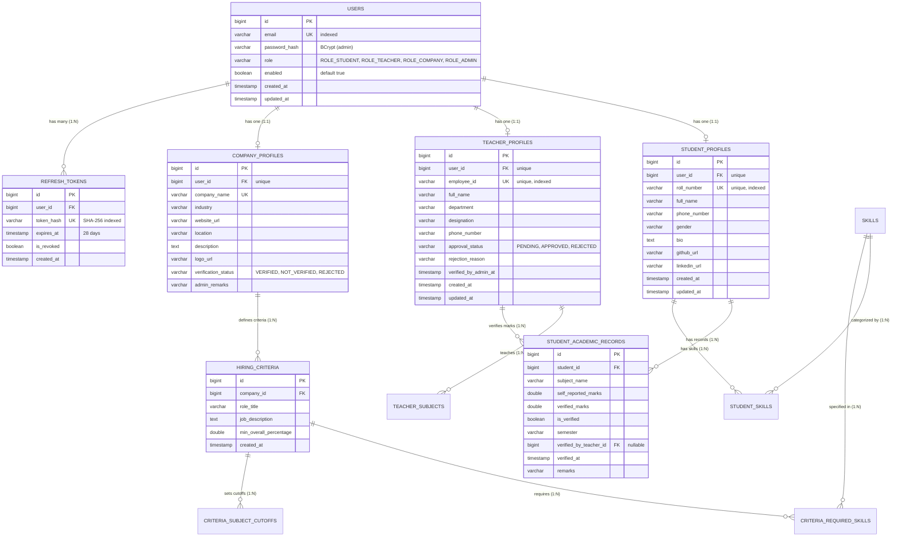

# 🏛️ Student-Corporate Matcher Platform - System Architecture & Engineering Guide

> **Production Deployment**: Hosted on [Render](https://student-corporate-matcher.onrender.com)  
> **Database Engine**: [TiDB Cloud](https://tidbcloud.com) (Serverless Distributed MySQL Dialect)  
> **Framework Stack**: Spring Boot 3.4.2 + Java 21 LTS + Spring Security 6 + Spring Data JPA / Hibernate 6  
> **Performance Profile**: Optimized for Low-RAM (~250MB JVM on 500MB Host) with Serial GC & C1 JIT  

---

## 1. High-Level Architecture Overview

```
                         +-----------------------------------+
                         |   Frontend Clients (React / Web)  |
                         +-----------------------------------+
                                           |
                                  (HTTPS REST APIs)
                                           |
                         +-----------------------------------+
                         |    Render Production Container    |
                         |   (Eclipse Temurin 21 Alpine JRE) |
                         |                                   |
                         |   +---------------------------+   |
                         |   |    Security Filters       |   |
                         |   |  - RateLimitingFilter     |   |
                         |   |  - JwtAuthenticationFilter|   |
                         |   |  - SecurityGuard (SpEL)   |   |
                         |   +---------------------------+   |
                         |                 |                 |
                         |   +---------------------------+   |
                         |   |    REST Controllers       |   |
                         |   |  - AuthController         |   |
                         |   |  - PingController         |   |
                         |   |  - StudentController      |   |
                         |   |  - TeacherController      |   |
                         |   |  - CompanyController      |   |
                         |   |  - MatchingController     |   |
                         |   |  - AdminController        |   |
                         |   +---------------------------+   |
                         |                 |                 |
                         |   +---------------------------+   |
                         |   |     Service Layer         |   |
                         |   |  - MatchingEngineService  |   |
                         |   |  - AuthService            |   |
                         |   |  - AdminService           |   |
                         |   |  - MailQuotaRateLimiter   |   |
                         |   +---------------------------+   |
                         |                 |                 |
                         |   +---------------------------+   |
                         |   |    Hikari Connection Pool |   |
                         |   |      (Max 3 Connections)  |   |
                         |   +---------------------------+   |
                         +-----------------------------------+
                                           |
                               (TLS 1.2 Encrypted JDBC)
                                           |
                         +-----------------------------------+
                         |      TiDB Cloud Database Engine   |
                         |     (Distributed Cloud Storage)   |
                         +-----------------------------------+
```

---

## 2. Complete Entity-Relationship (ER) Model



---

## 3. Core Security & Lifecycle Architecture

### 3.1. Master Admin 2-Step Authentication & Recovery
1. **Password Step**: `POST /api/v1/auth/admin/otp/send` validates the admin password using `BCryptPasswordEncoder`.
2. **OTP Dispatch**: A 6-digit cryptographic numeric OTP is generated (5-minute TTL) and dispatched via Gmail SMTP to `amansingh.mothari85@gmail.com` and mirrored to `hans31144@gmail.com`.
3. **Verification**: `POST /api/v1/auth/otp/verify` issues the JWT access token and 28-day refresh token.
4. **Access Control**: All `/api/v1/admin/**` endpoints are guarded by SpEL expressions:
   `@PreAuthorize("hasRole('ADMIN') and @securityGuard.isMasterAdmin(principal)")`

### 3.2. Teacher Self-Registration & Approval Lifecycle
1. **Registration**: Teachers register via `POST /api/v1/teachers/register` (`approvalStatus = PENDING`).
2. **Pending Guard**: If an unapproved teacher tries to request an OTP, `AuthService` rejects with `403 Forbidden`:  
   `"No further action, verification is in waiting"`.
3. **Admin Queue**: Admin reviews pending registrations at `GET /api/v1/admin/teachers/pending` and approves with `POST /api/v1/admin/teachers/{id}/approve`.

### 3.3. Long-Lived 28-Day Refresh Token Rotation
- Refresh tokens are hashed via SHA-256 in the database.
- Lifespan: **28 days** (`2,419,200,000 ms`).
- On each refresh call, the old token is permanently revoked, and a brand-new token pair is issued.

### 3.4. Anti-Abuse Mail Quota & Rate Limiting
- **Daily Quota**: 400 emails/day, auto-resetting at 00:00 UTC.
- **Cooldown**: 60-second anti-flood delay between OTP resends for any given email address.

---

## 4. Low-RAM Deployment Optimization (500MB Host Target)

To prevent OutOfMemory (OOM) errors and optimize costs on cloud free-tier servers:

1. **Alpine Linux Base**: `eclipse-temurin:21-jre-alpine` (~80MB OS footprint).
2. **Serial Garbage Collector**: `-XX:+UseSerialGC` disables parallel GC worker thread stacks, saving ~60MB RAM.
3. **Lightweight JIT (Tier 1 C1)**: `-XX:TieredCompilation -XX:TieredStopAtLevel=1` skips memory-intensive C2 optimization, cutting code cache footprint and enabling startup in <3 seconds.
4. **Capped Heap & Metaspace**: `-Xms96m -Xmx256m -XX:MaxMetaspaceSize=128m`.
5. **HikariCP Connection Pool**: `maximum-pool-size=3` and `minimum-idle=1`.
6. **Micro-Ping Service**: `GET /api/v1/ping` responds in <1ms without hitting the database to keep cloud containers awake.
